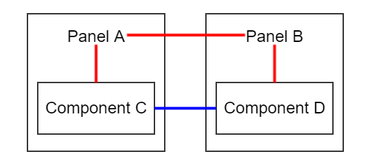

# 单向数据流驱动的游戏 UI

站在开发者的角度，游戏是什么？抛开 Journey、纪念碑谷一类高度艺术化的作品不谈，游戏就是一套 2D/3D 的核心玩法 + 一大堆 UI，这在页游与手游领域尤其明显，且呈现越坑钱 UI 越多的规律。

游戏开发中困难又有趣的技术集中在核心玩法，渲染、物理、AI、寻路、地形……一般人对游戏开发者的印象大都基于此。甚至一部分程序员以游戏程序自居，干着 UI 的活，却对这些年 APP UI 架构的快速演进视而不见。

近些年，APP 开发经历了 MVC、MVVM、数据驱动等阶段，光 Web 领域就产生了许多诸如 Angular、Vue、React 等优秀的应用框架，其中的设计思想尤其值得借鉴。本文基于当前流行的 Redux，讨论如何在游戏 UI 中引入单向数据流驱动的开发模式。

## Redux 的单向数据流

先用 Redux 来演示单向数据流的工作流程。

Redux http://redux.js.org 不是一个 UI 框架，Redux 是一个应用数据管理器，起初是为了代替 React 原配的 Flux 数据管理器而开发的，现已反客为主，成为 React 官方推荐的数据管理库。

React 作为比较重型的 Web App 开发框架，大多数游戏开发者可能没有接触过，NaNuNo 用的也比较少。但不用担心，Redux 对 React 没有任何依赖，本文也不会提到任何关于 React 的细节。Redux 库本身很小很简单（压缩后不到 4K），可以独立于 React 被其他框架使用的。


上图画出了 Redux 基本的设计思路。虚线右侧是 Redux，右侧可以连接到任意的 UI 框架，注意图中箭头的方向，应用中所有数据严格按照箭头单向流动，不允许逆转，故称为单向数据流。

Redux 有三个基础概念 Action、Reducer、Store。

Store 里存放应用数据，Store 由 Redux 维护，Store 对于应用是只读的。可以将 Store 当作简单的数据库（实际上是一个存放数据的 JS 对象）。

Reducer 是一个函数，用于更新 Store。用户负责编写，Redux 负责调用。Reducer 接受两个参数：旧的 Store 数据和发起的 Action，返回新的 store 数据。

```js
function reducer(oldStoreData, action) {
    // create a new store data from old store data
    // update new store data with info in action
  	// ......
    return newStoreData;
}
```

Action 是一个 JS 对象，用户负责编写，要求至少有一个说明类型的 type 字段，其他数据字段随意。每当用户修改 Store 都需要创建一个 Action 传递给 Redux，Redux 会处理好数据更新的工作。

```js
var action = {
    type: "ACTION_TYPE",
    // other data field ......
}
```

结合上面的图片来看文字版的 Redux 工作流程，以玩家购买道具为例：

1. 初始化 Redux，用 reducer 创建好 store，并让 UI 订阅 store 更新事件。

   ```js
   var store = Redux.createStore(reducer);
   store.subscribe(UI.onUpdate);

   function reducer(oldStoreData, action) {
       switch(action.type) {
       case "BUY_GOOD":
           var newStoreData = Object.clone(oldStoreData);
           newStoreData.gold -= action.gold;
           newStoreData.goodMap[action.goodId] += 1;
           return newStoreData;
       // case ......
       }
   }

   UI.onUpdate = function(store) {
       var newStoreData = store.getSate();
       // update UI base on newStoreData
       // ......
   }
   ```

2. 玩家点击购买按钮，UI 在点击事件处理函数中创建一个 Action，UI 调用 Redux.dispatch(action) 要求 Redux 处理更新。

   ```js
   UI.onButtonClick = function() {
       var action = {
           type: "BUY_GOOD",
           gold: 20,
           goodId: 17
       }
       Redux.dispatch(action);
   }
   ```

3. Redux 内部负责调用先前传入的 reducer，更新数据，触发数据更新回调。注意以**下代码发生在 Redux 内部**。

   ```js
   // inside Redux, not in user code.
   var newStoreData = reducer(oldStoreData, action);
   store.state = newStoreData;
   callback(store); // callback === UI.onUpdate
   ```


对比流程图阅读这段文字，可以理解 Redux 运行的基本流程。

上面的流程只描述了最基本的 Redux 运行流程，Redux 中大量采用了函数式编程的思想，比如 Redux 建议将 Reducer 实现为纯函数、Reducer 组合等。

上文用单个 Reducer 来举例，实际使用中 Reducer 必然要处理大量业务数据。Redux 提供了将多个 Reducer 函数组合成一个大的 Reducer 函数的方法， 组合后的 Reducer 生成的 Store 有多个字段，每个字段对应一个小 Reducer。

```js
function reducer1(oldState, action) {
    // ......
}
function redecer2(oldState, action) {
    // ......
}
var parentReducer = Redux.combineReducers({
    r1: reducer1,
    r2: reducer2
});
var store = Redux.createStore(parentReducer);
store.getState(); // => { r1: ..., r2: ... }
```

Store 被组织成和 Reducer 相同的树形结构。


## 单向数据流的优势

### 架构清晰去耦合

UI、业务逻辑（Reducer）、业务数据（Store）强制拆分。符合 MVC、MVP、MVVM 等设计模式期望的目标。

使用 MVC 架构时经常纠结 Model、View、Controller 的划分，写到后期 Controller 或多或少会和 Model 或 View 中的一个产生交叉。单向数据流中 UI（View）、Reducer（部分类似 Controller）、Store（Model）泾渭分明、绝无混淆的可能性。

UI 组件之间完全解耦。



传统 MV* 架构面临自组件通讯问题时有两种决绝方案。

* 沿红线由父组件代为传递。
* 沿蓝线两子组件直接通讯。

无论是哪种方案都需要引入额外的依赖，并且是双向依赖，界面复杂之后依赖像蜘蛛网。


单向数据流本身就能处理这种情况，组件之间全部交货通过 Redux 管理。父组件单向依赖子组件，子组件可以完全不知道父组件存在。

### 便于调试和测试

在单向数据流中，除了用 Action 调用 Redux.dispatch() 申请更新，没有任何修改数据的手段，这使所有数据修改变得可追踪，必要时甚至可以讲整个 Store 改变的流程录制下来（chrome 里已经有了这种 Redux 插件），大大简化调试。

单元测试时不需要再 monk 一大堆对象，模拟一个 Store 就够了。

若严格遵循 Redux 规范将 Reducer 实现为纯函数，对调试更有有利。纯函数这正确性仅仅依赖于函数的输入，和函数运行的外部环境无关，是一种非常容易测试的范型。

### 天生支持成就任务等系统

单向数据流模式中 Action 是高度语义化的，type 字段 + 额外的数据完全可以描述当前 Action 期望行为。dispatch 触发 Action 天生是广播的，为成就、任务等系统带来了很大的方便。

通常情况下，成就和任务系统要么监听其他系统的改变、要么由其他系统主动通知。无论哪种情况都需要引入额外的代码，主动通知还经常容易忘记调试困难。

使用单向数据流成就和任务只需实现成普通的 Reducer，处理关心的物品买卖、怪物杀死、剧情进度等 Action，和别的模块没有任何区别。

### 实现简单

单向数据流足够简单，可以方便地在任何弱类型，支持函数作为参数传递的语言中实现。

对于懒人很重要！很重要！

## 单向数据流的缺点与解决办法

已经说过了单向数据流的优势，谈一谈单向数据流的缺点，这些缺点在游戏 UI 中要么不容易遇见，要么可以避免的，所以说单向数据流适合做游戏 UI。

###  有些数据天生是双向的

有些数据天生是双向的，经典案例：输入框。既接受用户输入保存，又可以被程序修改输入内容。

问题是为什么 Redux 要管理到输入框如此低层级的 UI 组件上。React 中有一个很好的理由，组件复用。Web APP UI 层级复杂有必要将一个界面拆成多个组件，回想一下微博页面有多少个小功能块吧。

从零开始的游戏单向数据流模式没有任何可复用的组件。游戏的 UI 数量大，但都比较简单，几乎没有跨页的界面，至多上个滚动列表，手游尤其如此。如果将 Redux 限定在面板层级会大大缓解这个问题。

面板里面的小组件原来怎么写现在还是怎么写。每个面板都有一个 onUpdate() 接口，由这个接口监听 Store 修改，主动更新整个面板。组件粒度大了，很多临时数据可以不通过 Redux 通信，父组件单向控制子组件很正常，面板也不复杂，用户输入的提交大都延迟到面板退出或确定时，避免不必要的数据更新。

### Store（Reducer）树不好重构

设计 Store（Reducer）树等价于给应用设计数据模型。

应用的数据模型有可能随业务变化调整，最初设计的数据模型到最后不一定适用。假如 Store 树嵌套层次太深或不同子树需要维护同一份数据，Store 树会面临重构问题。单向数据流对需要调整 Store 树结构的重构不友好。 UI 界面对 Store 有强依赖，并且是多个界面依赖一个 Store 子树，调整数据模型，牵一发而动全身。

游戏的数据天生是明确的，由策划认为设计，比从现实生活中抽象数据模型明确多了。数据层级是趋于扁平化。装备、素材、消耗品、角色、工会、抽奖基本就那样嘛。设计的数据模型不容易改变，即使发生了改变也不会发生消耗品变成角色的问题，修改范围限制在少数相关界面。

建议将 Store 设计为一层或两层结构。装备、素材、消耗品、角色、工会、抽奖等大类处于第一层，每一个大类可以按需求决定是否引入小类（多数情况下不需要）。

### 性能问题

性能问题通常不是性能本身是取舍问题。代码架构的整洁、可测试性、开发速度等都可能与性能产生矛盾，完全看团队的需求与偏向。好消息是 Redux 的柠檬还很水灵，挤出点性能不困难。比如：

Store 更新后的通知事件是全体广播，这会使全部显示中的页面都刷新一遍，可添加适当的过滤条件，如果界面上显示的内容完全没有更新就不刷新界面。

界面 onUpdate 中会刷新所有的子组件，大部分情况下子组件不需要全部刷新，可以对当前显示数据与 Store 中的数据做 Diff 检测。尤其刷新列表类组件，大部分列表项是可以重用的，参考 Vue 中的优化方法即可。

### 强类型语言

之前的全部讨论，假设了游戏界面由脚本语言编写。由于单向数据流模式，尤其是 Redux 中使用了大量函数式编程的思想，不能直接移植到强类型语言，需要使用反射模板等复杂机制。

## 总结

单向数据流模式在模块拆分、调试、测试方面天生有很大优势，语义化的 Action 与事件广播为游戏内某些系统实现带来了很大方便。完全可以应用到游戏 UI 开放中，管理整个游戏的数据流。

至于文中最后提到的强类型语言问题，NaNuNo 正在考虑用 C# 实现单向数据流，可能会在随后的[C# 单项数据流实现]()文中放出。
